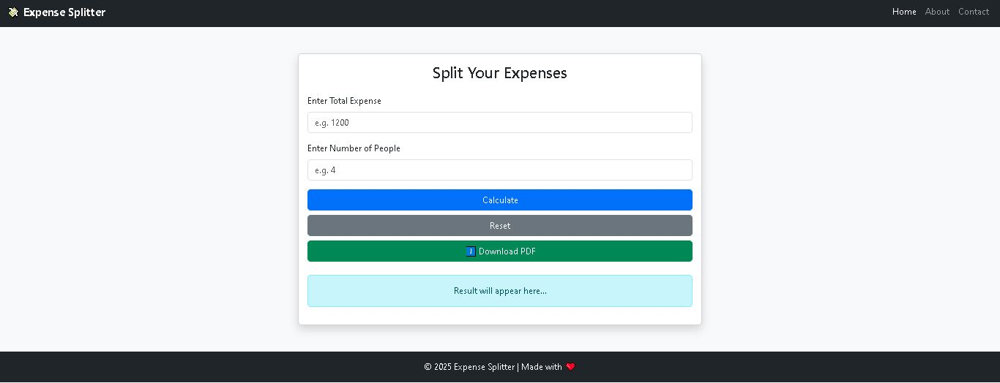

# 💸 Expense Splitter

A **responsive web app** built with **Bootstrap** and **JavaScript** to quickly split expenses among multiple people.  
Perfect for roommates, trips, or group outings.

---

## 🚀 Features

- **Responsive Design** – Works flawlessly on desktop, tablet, and mobile.  
- **User-friendly Input** – Enter total expense and number of people.  
- **Instant Calculation** – See how much each person should pay.  
- **Dark Mode Toggle** – Switch between light 🌞 and dark 🌙 themes.  
- **Download Result as PDF** – Save the calculation result easily.  
- **Modern UI** – Clean Bootstrap card layout with alerts and buttons.  

---

## 📸 Demo Screenshot

  

---

## ⚡ Usage
1) Open the Website: https://expense-splitter-weld.vercel.app/
2) Enter total expense and number of people.
3) Click Calculate to see the result.
4) Toggle Dark Mode 🌙 or download the result as PDF ⬇️.

---

## 🛠 Technologies Used
1) HTML5
2) CSS3
3) Bootstrap 5 – for responsive layout & components
4) JavaScript – for logic & DOM manipulation
5) jsPDF – for generating PDF reports
